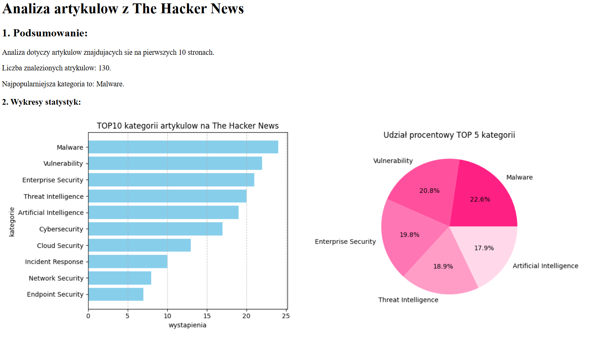

# The Hacker News Scraper & Analyzer 

Projekt automatyzujący zbieranie informacji na temat artykułów o cyberbezpieczeństwie z portalu The Hacker News.

## Funkcje:
- Scraping danych przy użyciu **Selenium**.
- Analiza statystyczna kategorii artykułów.
- Generowanie wizualizacji w formie wykresów (**Matplotlib**).
- Automatyczne tworzenie raportu w formacie **HTML**.

## Jak uruchomić:
1. Sklonuj repozytorium: `git clone [https://github.com/agrzesiuk/thn-scraper.git]`
2. Zainstaluj wymagania: `pip install -r requirements.txt`
3. Uruchom skrypt: `python main.py`

## Fragent wygenerowanego raportu html:

